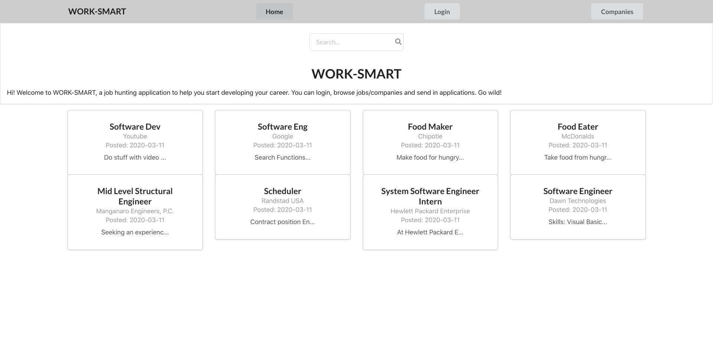
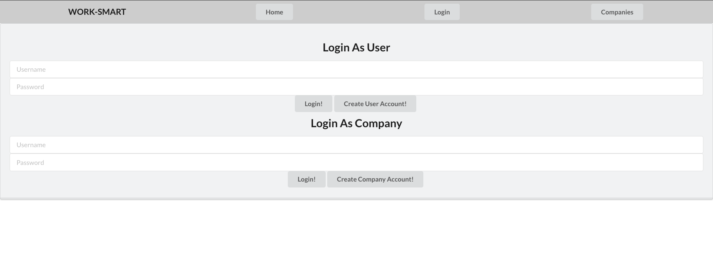
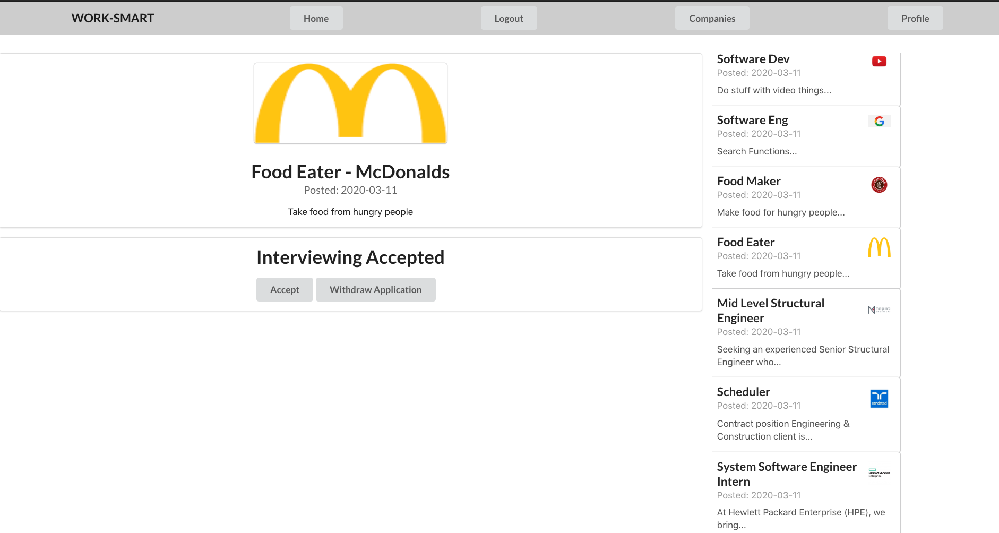

# README

# WorkSmart

    A front-end job platform to find and apply to jobs. Allows companies to post jobs, view candidate’s applications, schedule interviews and hire them for available positions.

# Requirements 

    $ node --version
    v12.14.0

    $ npm --version
    6.13.4

    $ rails -v
    6.0.2.1

# Quick Overview

    First, clone/fork-clone the WorkSmart app. Once your inside of that repo run the following:

                cd worksmart/jobs-backend
                rails db:migrate && rails db:seed && rails db:start

    This will automatically migrate the database,seed the data from the seed file and 
    start the server on http://localhost://3000

    Then run on another bash the following:

                cd worksmart/jobs-frontend
                npm install && npm start
            
    This will run the app on http://localhost://3001

# Languages and Frameworks 

    Implemented UI design with HTML5, CSS and Semantic UI.
    Created a single page web application with React-Routers.
    Developed Rails API and PostgresSQL as a database.
    Utilized JSON Web Tokens and localStorage to store encrypted user information with the JWT algorithm.

# Project Sceen Shots

  

 

     

# File Structure - Front-End

    # public/
    This is where your application will be compiled. Assets, like images and fonts, should be placed directly within this folder. Also in this folder is a default index.html file for serving up the application.

    # src/
    The client folder houses the client application for the project. This is where the client-side Javascript components and React components live.

    # src/main-container 
    This is where the Login and Navigation files are located.It handles the Login and Signup.The Nav components handle the login by generating the profile link deppending on the user as a simple user or company.

    # src/content 
    The Content components handles the fetches depending who the user is and shows jobs and companyies that are releated to that user.Also different Route paths are handled in this component.

    # src/components 
    This folder contains all the reusable components for jobs and companies.

    # scr/child-compoentns
    This folder contains all the card component for a single company and jobs card and container.

# File Structure - Back-End

    # app/
    This is where the subdirectories for models, views, controllers and serializers are located.

    # db/
    This is where the migratin,schema and all the seeded data are located.

# Contribution

Pull requests are more than welcome. For major changes, please open an issue first to discuss what you would like to change.

This project does not have any tests.

This project was bootstrapped with [Create React App](https://github.com/facebook/create-react-app).

